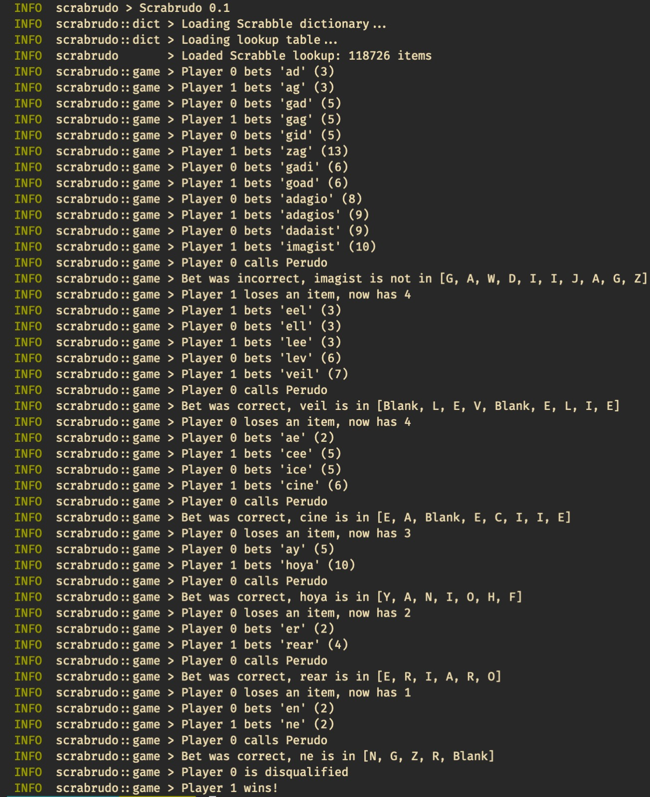

# Scrabrudo
A letter-based variant on a game of dice estimation written in Rust.


*An example AI-vs-AI game of Scrabrudo*

More generally, this repository provides a general framework for defining games of the following format:

- Players have a "hand" made up of items randomly sampled from some set of orderable things
- Players can only see their own hand
- Play proceeds clockwise by placing bets of the form "there are at least N of a certain instance of item X on the table"
- Each player may either raise the bet ("there are at least N+1...") or call the bluff of the player before them
- When the bluff is called, if the bet was correct then the calling player loses an item; otherwise the better loses an item
- When out of items, a player is disqualified
- Play proceeds until only one player remains

A simple version of [https://en.wikipedia.org/wiki/Dudo](Perudo), for example, can be made from the above with:
- the items being dice
- the hand being a collection of 5 dice
- the ordering taking place over tuples of (dice value, quantity) such that e.g. "four fives" is a lower bet than "two sixes"

There are other rules to Perudo (the special role of 1s, Palafico, Calzo, etc) which are accounted for in the `PerudoGame` implementation.

We provide a reference implementation of Perudo as well as a variant (Scrabrudo...) played with Scrabble tiles, in which players must guess whether increasingly long words can be made using the letters in every hand.

## Playing

To play Scrabrudo against 1 other AI player, with human going first, run:

```sh
RUST_LOG=info cargo run --bin scrabrudo -- --human_index=0 --dictionary_path=data/<dict>.txt --lookup_path=data/<lookup>.bin
```

To play basic Perudo against 3 AI players:

```sh
RUST_LOG=info cargo run --bin scrabrudo -- --mode=perudo --human_index=0 --num_players=4
```

## Notes on Initialization

The below are notes on the AI construction; as far as I can tell, playing mathematically 'perfect' Perudo (in a non-Bayesian sense, e.g. disbelieving everything everybody else bets) is intractable in the Scrabble-tile variant case, and so we use Monte Carlo simulation to work out the probability of every subset of every legal word.

### Details

The tile variant of the game requires multinomial CDF probability calculations (e.g. I want to know the probability that 'cat' is on the table - I hold a 'c' and my opponents have 10 tiles between them. This is:

```
P(a > 1, 0 < b <= 10, 0 < c <= 10, 0 < d <= 10, ... t > 1, ...0 < z <= 10)
```

I haven't found a fast way of computing this; this results in almost 10^26 evaluations of the tractable multinomial PDF (basically every 26-tuple except those where a=0, t=0).

More efficient is the probability 'cat' is not on the table. This is all tuples where a=0 or t=0. However, this is still about 10^25 evaluations, which only increases with the number of dice on the table.

Therefore, instead, we perform Monte Carlo simulation for every possible valid subset of letters we might want to find in the tiles on the table. This is a large precomputation, as each of the 170K words reduces down to 100s of sub-words, which we sort and then sample N tiles, seeing how many times the tiles actually appear.

The lookup table is stored as `data/lookup_<max_num_tiles>_<num_trials>.bin`. It is created by e.g.:

```sh
RUST_LOG=info cargo run --bin precompute -- --num_tiles=5 --num_trials=1000 --dictionary_path=... --lookup_path=<output>
```

Which would compute enough of the table for 2 player, 5 tiles each play - since it will cover all possibilities of searching for any valid substring within 5 tiles. This runs 1000 trials per subword.

The game ships with a lookup table, so no need to regenerate, but the larger the table, the larger the words can be.
